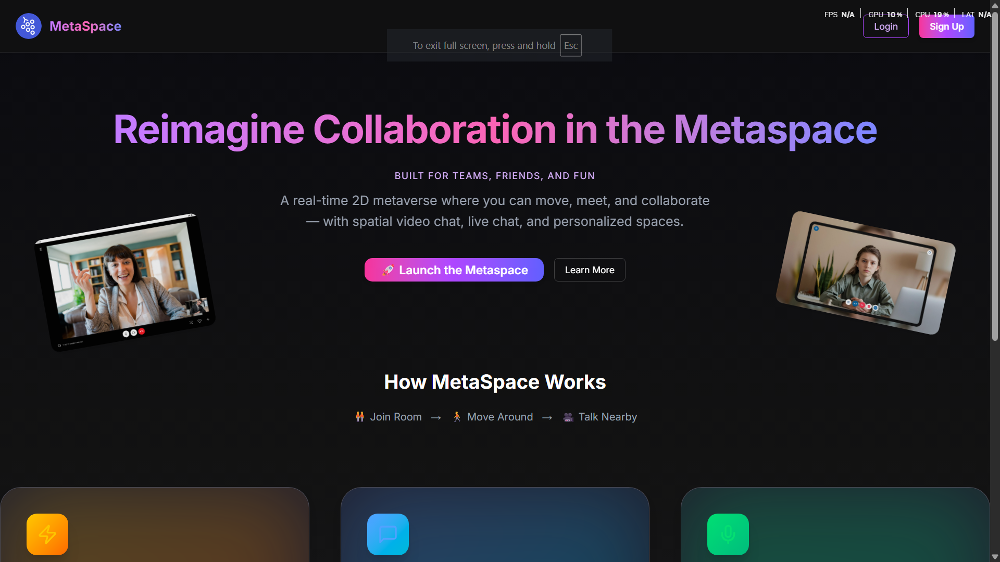
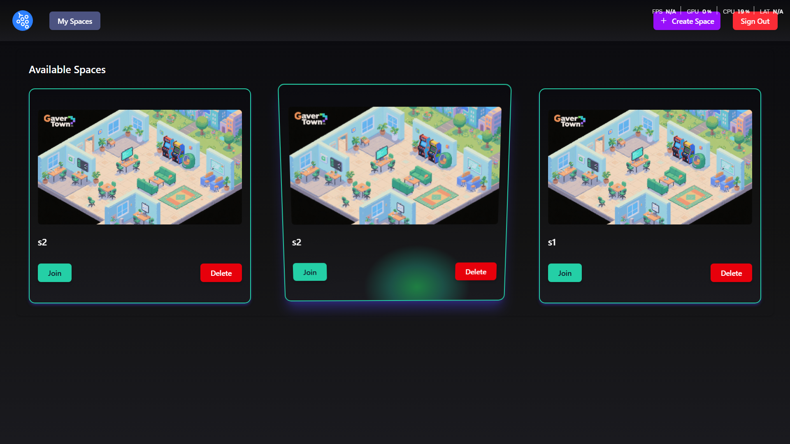
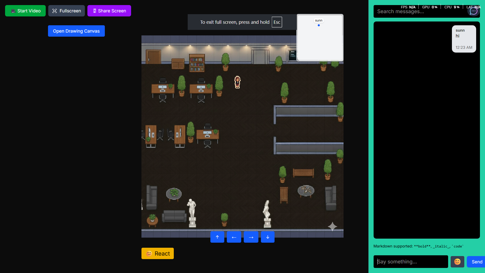
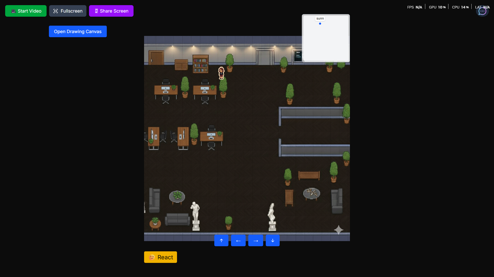
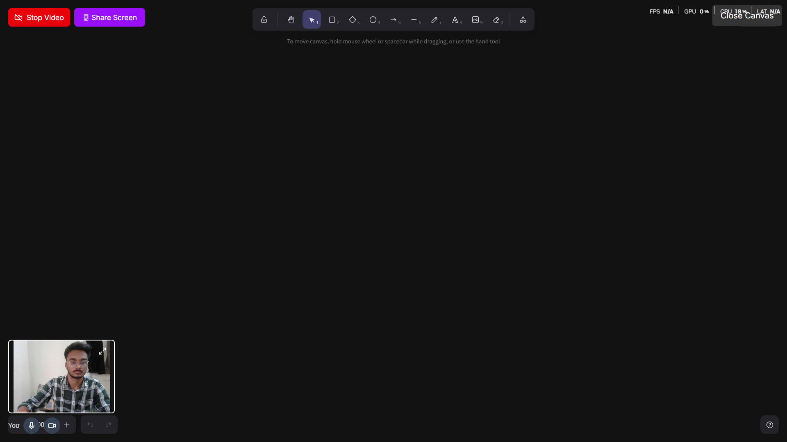
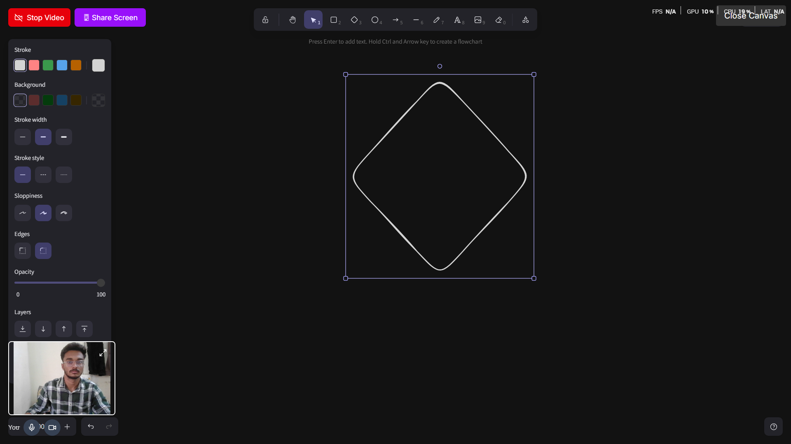
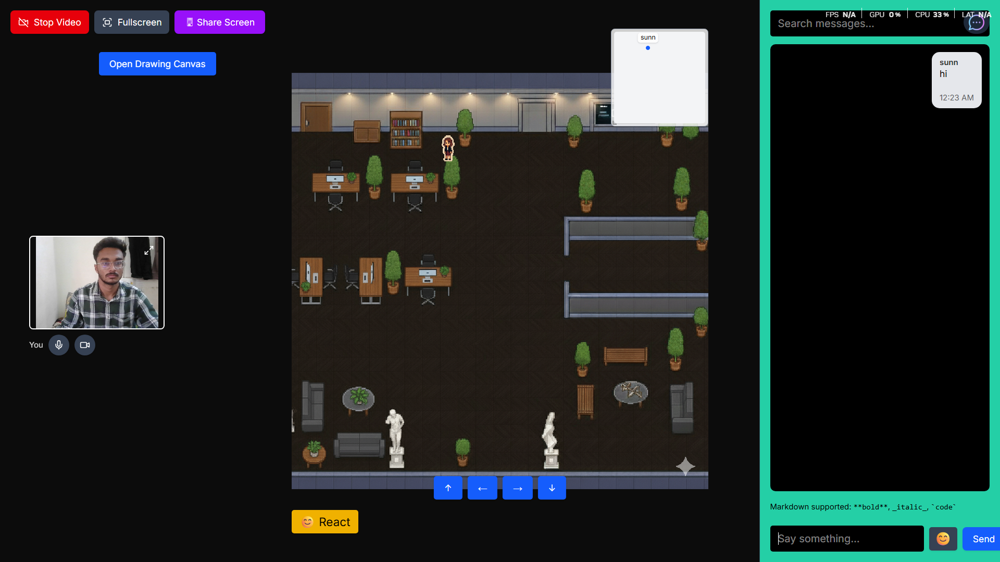

# 🪐 2D Metaverse Platform

A **browser-based 2D Metaverse** enabling real-time collaboration and interaction with:

🖥️ WebRTC-powered video conferencing  
💬 Live chat system  
📝 Interactive Excalidraw whiteboard  
🤖 AI-driven conversational agents powered by Gemini AI  
🎭 Dynamic avatar reactions  
🔗 Secure multi-tenant architecture with PostgreSQL persistence  
⚡ Low-latency WebSocket & HTTP backend for high availability  

Built using **Next.js, Node.js, WebSockets, PostgreSQL, and Docker**, this platform ensures scalable, fault-tolerant, and cross-platform performance.

---

## 🚀 Features

- 🎥 Real-time **video calls**, **chat messaging**, and **screen sharing**
- ✏️ Interactive **whiteboard** for collaborative drawing and planning
- 🤖 AI-enhanced avatars that **react and converse** with users
- 🗄️ Persistent data storage with **PostgreSQL**
- 🐳 Scalable microservices deployed using **Docker Compose**
- ⚡ **Low-latency communication** using WebSocket and HTTP protocols
- 🧩 Multi-tenant, secure architecture for multiple spaces/users

---

## 🎥 Demo Video

> ▶️ **Watch the full project walkthrough:**  

---

## 📸 Screenshots

| Lobby View | Real-Time Collaboration | Video Call & Emoji Reactions |
|-------------|-------------------------|-------------------------------|
|  |  |  |
 | | |
| | | 

---

## 🏗️ Architecture

| Service | Container | Role |
|----------|------------|------|
| **Frontend** | `sunnyrajput9198/meta-frontend` | Next.js UI, connects to WS & HTTP API |
| **HTTP API** | `sunnyrajput9198/meta-http` | Handles REST APIs, authentication, database queries |
| **WebSocket** | `sunnyrajput9198/meta-ws` | Real-time events: movement, chat, reactions |
| **Database** | PostgreSQL | Stores users, spaces, chat messages, avatar states |

---

## 🧠 Tech Stack

**Frontend:** Next.js, TailwindCSS, Zustand  
**Backend:** Node.js, WebSocket (ws), Express, Prisma  
**Database:** PostgreSQL  
**Infra:** Docker, Turborepo  
**AI:** Gemini API (LLM-based conversational agents)

---

## 💡 Highlights

- Built **real-time multiplayer world** with synchronized avatar movement and emoji reactions.  
- Integrated **LiveKit SFU** for scalable group video calls.  
- Designed **singleton RoomManager** for efficient state handling across distributed WebSocket clusters.  
- Achieved **<100ms latency** in event broadcasting through optimized message batching.  
- Fully containerized stack for easy scaling and CI/CD pipeline integration.

---