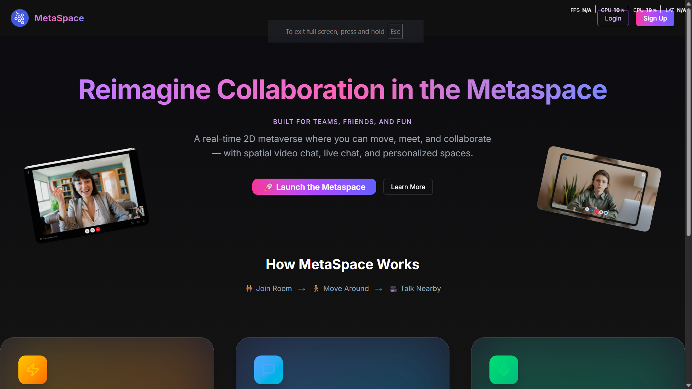
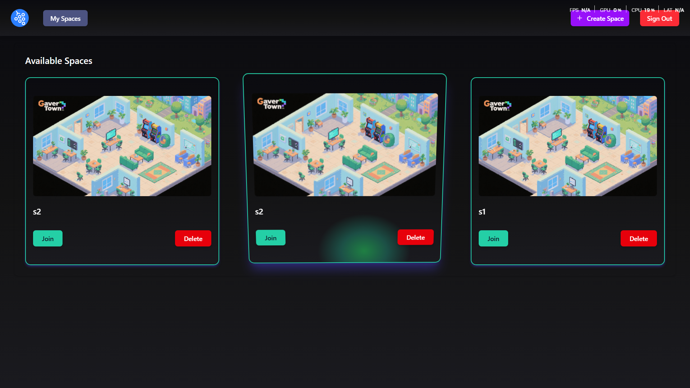
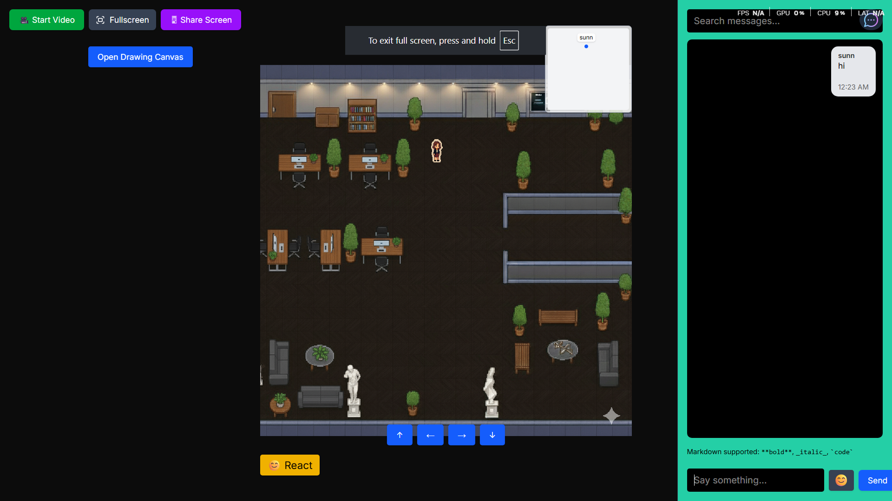
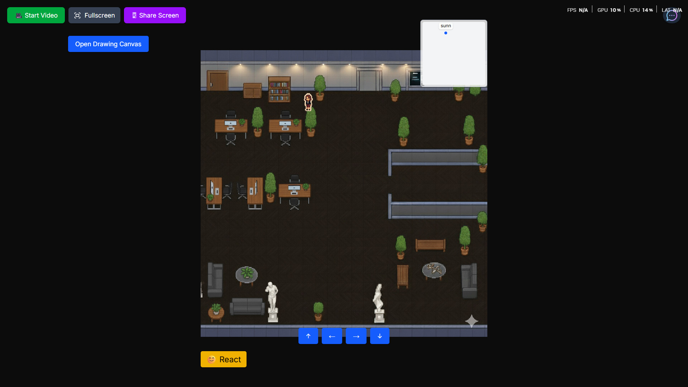
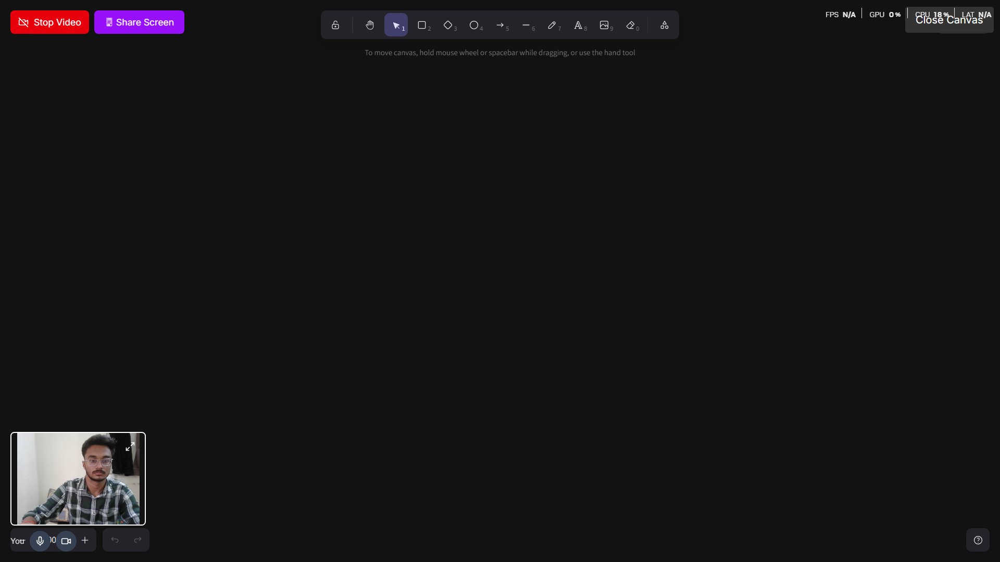
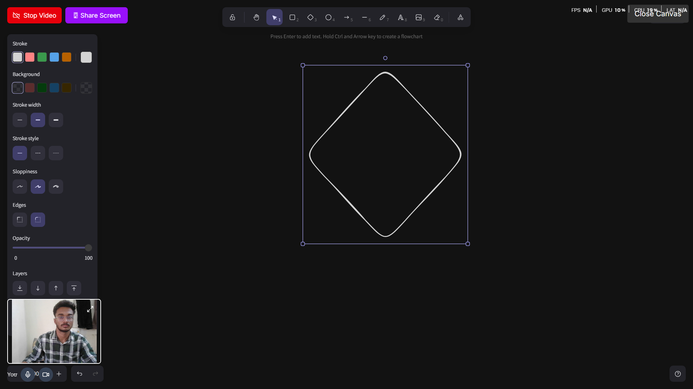

# 🪐 2D Metaverse Platform

> 🌍 **A browser-based 2D metaverse enabling real-time collaboration, video calls, and AI-driven interactions.**
---


## 🧩 Problem & Vision

Traditional video calls feel static and disconnected.  
**Metaspace** reimagines remote interaction by merging **2D spatial collaboration**, **AI-driven avatars**, and **real-time communication** — making online meetings as engaging as physical ones.

---

## ✨ Features

- 🎥 **Real-time video calls**, chat messaging, and screen sharing  
- ✏️ **Collaborative whiteboard** (Excalidraw) for visual brainstorming  
- 🤖 **AI-enhanced avatars** with conversational and reactive behavior (Gemini API)  
- ⚡ **Low-latency WebSocket** communication for real-time presence (<100ms)  
- 🗄️ **PostgreSQL** persistence for spaces, chat, and avatars  
- 🐳 **Dockerized microservices** with CI/CD-ready architecture  
- 🔐 **Secure multi-tenant** setup — isolated spaces and roles  
- 📡 **LiveKit SFU** integration for scalable video conferencing  

---

## 🧠 Tech Stack


**Frontend:** Next.js, TailwindCSS, Zustand  
**Backend:** Node.js, WebSocket (ws), Express, Prisma  
**Database:** PostgreSQL  
**Infra:** Docker, Turborepo  
**AI:** Gemini API (LLM-powered agents)  

---

## 🎥 Demo Video

> ▶️ **Watch the full project walkthrough:**  
[](https://drive.google.com/file/d/12QzX-X3KI6v8NM7hDibHUMDv8DwJ0h7g/view?usp=drive_link)

---

## 📸 Screenshots

| Home View | Dashboard View | Space View |
|-------------|-------------------------|-------------------------------|
|  |  |  |

| Lobby View | Whiteboard | Multi-User Session |
|-------------|--------------|--------------------|
|  |  |  |

---

## 🏗️ Architecture Overview

| Service | Container | Role |
|----------|------------|------|
| 🖥️ **Frontend** | `sunnyrajput9198/meta-frontend` | Next.js UI connecting to WS & HTTP APIs |
| ⚙️ **HTTP API** | `sunnyrajput9198/meta-http` | REST APIs, authentication, Prisma DB queries |
| 💬 **WebSocket Server** | `sunnyrajput9198/meta-ws` | Real-time movement, chat, and reactions |
| 🗄️ **Database** | PostgreSQL | Stores users, spaces, messages, avatar states |

📈 **Latency:** <100 ms event broadcast  
🧩 **Scaling:** Horizontal scaling with Docker Compose & Nginx load balancing  

---

## 🚀 Getting Started

```bash
# Clone the repository
git clone https://github.com/SunnyRajput9198/2-d-metaverse.git
cd metaverse/meta

# Install dependencies
npm install

# Start the dev server
npm run dev
